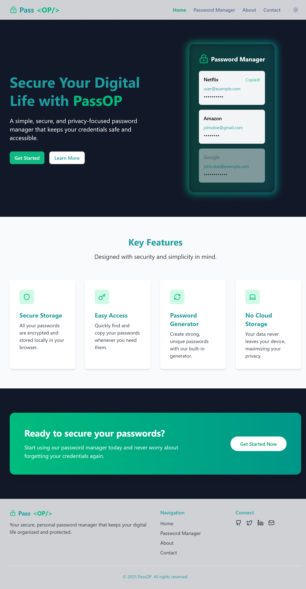
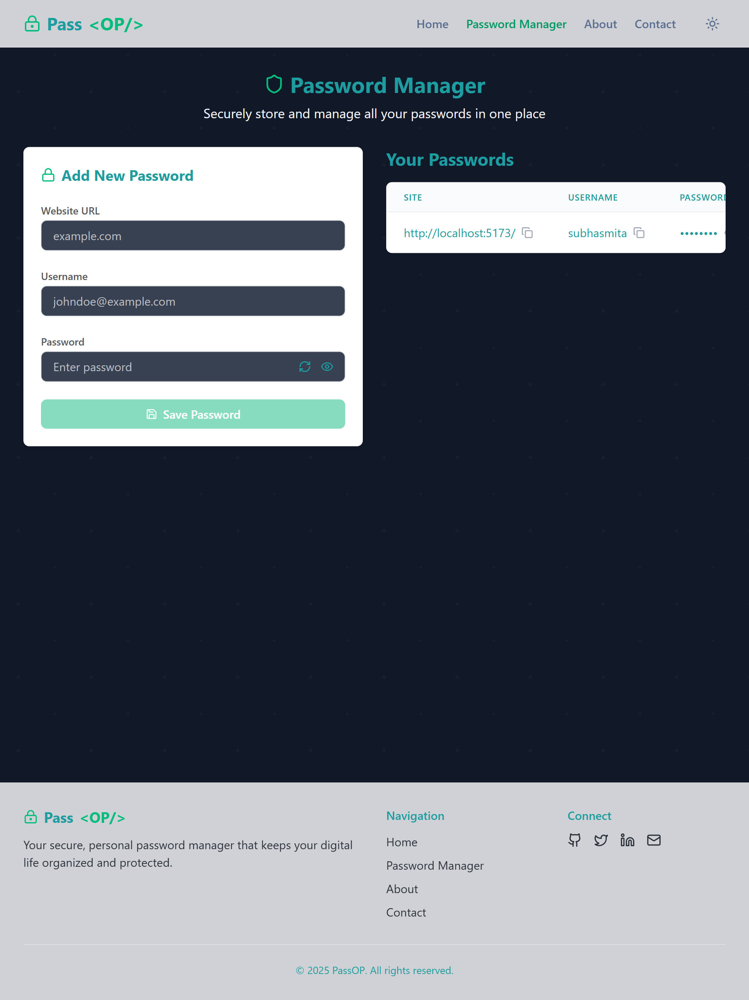
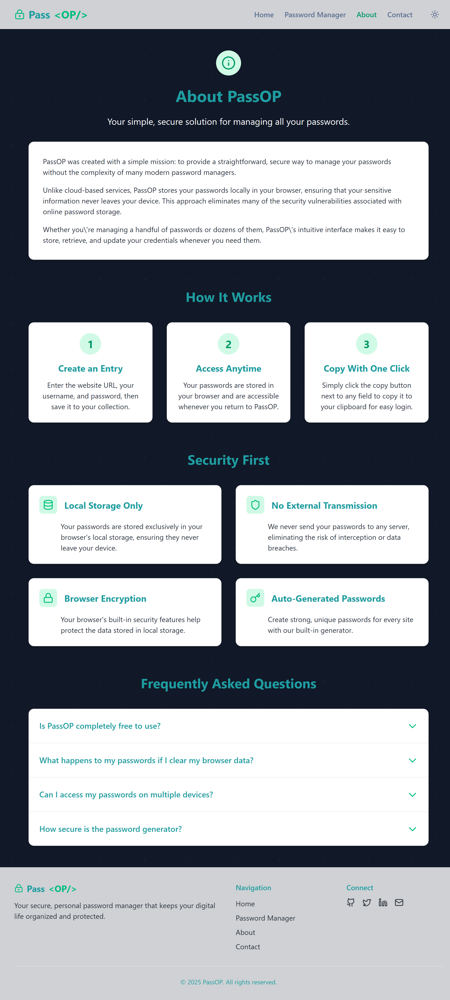
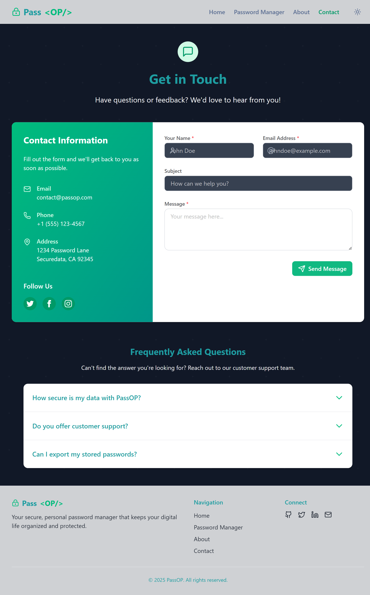
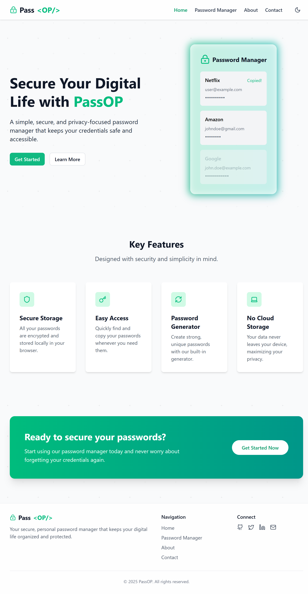
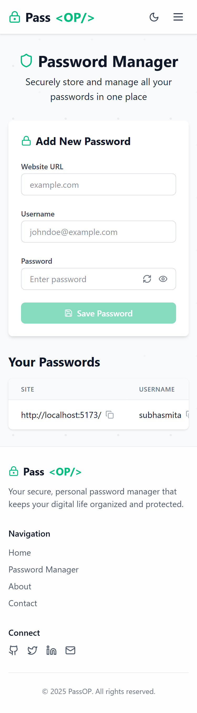
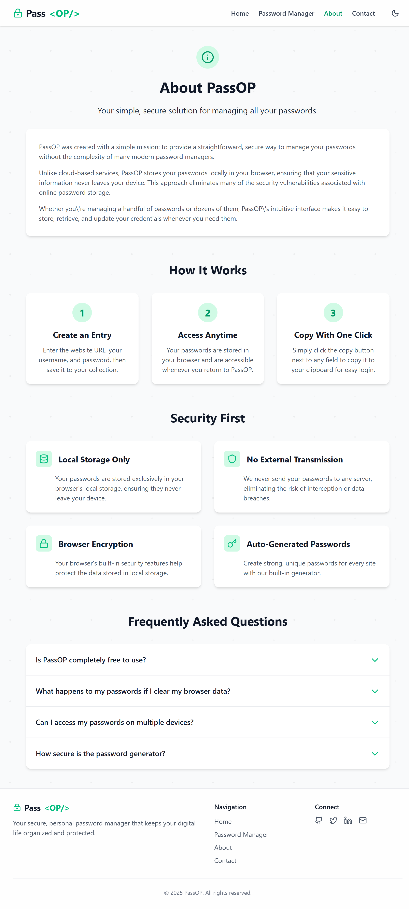
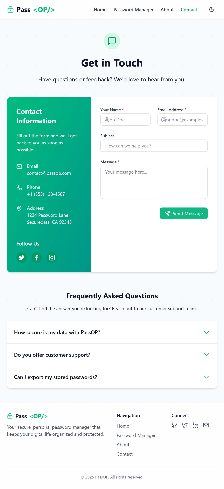

# 🔐 Password Vault – Secure Your Digital Life

[](https://password-manager-wheat-theta.vercel.app)
[]()

---

## 🔍 Overview

**Password Vault** is a modern password manager that allows users to securely store, manage, and retrieve login credentials in one place. Built with security and simplicity in mind, it is the perfect tool for anyone looking to keep their passwords safe and accessible.

> 💡 [Check out the live app](https://password-manager-wheat-theta.vercel.app)

---

## 🧩 Key Features

- 🔐 **Secure Storage**: Add and store passwords safely.
- 🔍 **Quick Search**: Instantly find stored credentials.
- 👁️ **Visibility Toggle**: Show/hide password feature.
- 🧽 **Clear All**: Option to remove all saved data.
- 🌙 **Dark/Light Mode**: Switch themes based on your preference.
- 💾 **LocalStorage Based**: Keeps data persistent across sessions (no backend required).
- ⚛️ **Built with React.js**: Dynamic and smooth interface experience.
- 📱 **Responsive UI**: Works seamlessly on mobile, tablet, and desktop devices.

---

## 🛠️ Tech Stack

- **Framework**: React.js, Next.js
- **Styling**: Tailwind CSS
- **Storage**: Browser LocalStorage
- **Deployment**: Vercel

---

## 📸 Screenshots In DarkMode

| Dashboard |

  

|Add Password |

  

 | About Page |



 | Contact Page |



## 📸 Screenshots In LightMode

| Dashboard |

  

|Add Password |

  

 | About Page |



 | Contact Page |




---

## 🚀 Getting Started

```bash
# Clone the repository
git clone https://github.com/your-username/password-vault.git

# Navigate to the project directory
cd password-vault

# Install dependencies
npm install

# Start the development server
npm run dev
```

---

## 📁 Project Structure

```
/pages          # Next.js routes
/components     # UI Components
/utils          # Utility functions (e.g., password visibility)
/styles         # Tailwind CSS and custom styles
```

---

## 🧠 Future Improvements

- 🧩 Integration with a secure backend for encrypted storage
- 🔑 Password generation tool
- 🔐 Master password login
- 🌍 Cloud sync for multi-device access

---

## 👩‍💻 Developer

**Subhasmita Sahoo**  
Frontend Developer | UI/UX Enthusiast | Code Security Advocate


📍 Khordha, Odisha  
📫 [Email me] (mail to: subhasmita4602@gmail.com)  
🌐 [Portfolio](#) | 💼 [LinkedIn](https://www.linkedin.com/in/subhasmita-sahoo-puja/) | 💻 [GitHub](https://github.com/subhasmita-puja)


---

## 📄 License

Licensed under the [MIT License](LICENSE).

---

> ⭐ Star this repo if you find it helpful!
